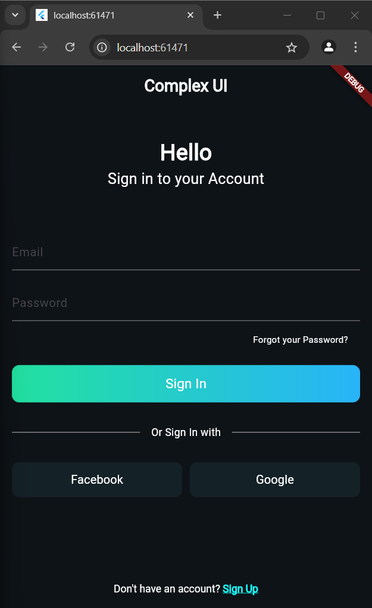

# Complex UI Flutter App

This Flutter application demonstrates a complex user interface built using `Column`, `Row`, and `Container` widgets. It includes interactive elements like text fields, buttons, and a gradient-styled "Sign In" button. The design is intended for a login screen with social media sign-in options.

## Features
- **Text Fields**: Inputs for email and password.
- **Buttons**: 
  - Gradient background button for "Sign In."
  - Social media buttons for Facebook and Google sign-in.
- **Interactive Elements**: Includes links and buttons with on-tap interactions.

## UI Preview



## Getting Started

### Prerequisites
- Flutter SDK
- Any IDE that supports Flutter development (e.g., Android Studio, VS Code)

### Installation
1. Clone this repository:
   ```bash
   git clone https://github.com/jtareen/lab4-task2.git
   ```
2. Navigate into the project directory:
   ```bash
   cd complex-ui-flutter
   ```
3. Run the app:
   ```bash
   flutter run
   ```

## Code Structure

- **main.dart**: Contains the UI code that uses `Column`, `Row`, and `Container` to build the layout.
- **assets/screenshot/image.png**: Screenshot of the app (as shown above).

## License

This project is licensed under the MIT License - see the [LICENSE](LICENSE) file for details.
